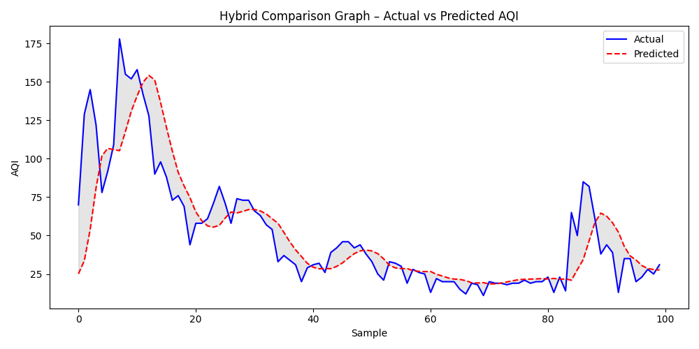

🧭 AeroSense — AI-Powered Indoor Air Quality & Ventilation Optimizer
⚙️ Overview

AeroSense is an AI-driven system for predicting and optimizing indoor air quality (IAQ) in real time.
It uses IoT sensor data (CO₂, VOC, PM2.5, temperature, humidity) combined with a Hybrid Artificial Immune System (AIS) + Quantum-behaved Particle Swarm Optimization (QPSO) tuned LSTM model to forecast AQI trends and recommend intelligent ventilation or purifier control actions.

🧱 System Architecture
┌──────────────────────────────┐
│ IoT Sensor Layer (ESP32)     │
│ • MQ135 – CO₂ & VOC Sensor   │
│ • PMS5003 – PM2.5 / PM10     │
│ • DHT22 – Temperature & RH   │
└───────────────┬──────────────┘
                │ MQTT
                ▼
         Edge Gateway (Raspberry Pi)
                │
                ▼
       Hybrid AIS + QPSO Optimized LSTM
                │
                ▼
      Streamlit Dashboard + Alerts

📂 Folder Structure
Indoor Air Quality & Ventilation Optimizer/
│
├── archive/
│   └── indoor_data.csv                      # Input dataset
│
├── aerosense_train_hybrid_AIS_QPSO.py       # Training script
├── hybrid_aerosense_predict.py               # Prediction script
│
├── hybrid_aerosense_model.h5                 # Trained hybrid LSTM model
├── hybrid_aerosense_scaler.pkl               # Saved MinMax scalers
├── hybrid_aerosense_config.yaml              # Model configuration
├── hybrid_aerosense_results.csv              # Actual vs Predicted AQI
├── hybrid_aerosense_prediction.json          # Evaluation metrics
│
├── hybrid_aerosense_accuracy_graph.png       # Training vs validation loss
├── hybrid_aerosense_heatmap.png              # Feature correlation
├── hybrid_aerosense_result_graph.png         # Scatter plot
├── hybrid_aerosense_prediction_graph.png     # Time-series AQI prediction
├── hybrid_aerosense_comparison_graph.png     # Actual vs Predicted comparison
│
└── README.md

📊 Dataset

Path:

C:\Users\NXTWAVE\Downloads\Indoor Air Quality & Ventilation Optimizer\archive\indoor_data.csv

Typical columns:

['created_at', 'entry_id', 'field1', 'field2', 'field3', 
 'field4', 'field5', 'field6', 'latitude', 'longitude', 
 'elevation', 'status']

Auto-renamed by the script as:

['CO2', 'VOC', 'PM2.5', 'Temperature', 'Humidity', 'AQI']

🔬 Modeling Pipeline
Phase	Description
1️⃣	Data Pre-processing: cleaning, renaming, scaling
2️⃣	Sequence Creation: converts time-series to LSTM windows
3️⃣	Hybrid Optimization: AIS performs immune cloning + mutation; QPSO fine-tunes parameters
4️⃣	Model Training: LSTM predicts next-hour AQI
5️⃣	Visualization & Saving: all graphs and model artifacts saved automatically
🧠 Hybrid Optimization Details
Component	Role
AIS (Artificial Immune System)	Explores the hyperparameter space via cloning & mutation of candidate solutions
QPSO (Quantum-behaved PSO)	Refines promising antibodies using quantum behavior for global convergence
Hybrid Benefit	Combines AIS exploration + QPSO exploitation → better RMSE / R² performance
🧰 Tech Stack
Layer	Tools
Data	Pandas · NumPy
Model	TensorFlow / Keras LSTM
Optimization	Hybrid AIS + QPSO
Visualization	Matplotlib · Seaborn
Control Integration	MQTT · ESP32 · FastAPI (optional)
⚙️ Setup Instructions

Install dependencies

pip install tensorflow pandas numpy matplotlib seaborn scikit-learn pyyaml

Verify dataset path

C:\Users\NXTWAVE\Downloads\Indoor Air Quality & Ventilation Optimizer\archive\indoor_data.csv

Train the hybrid model

python "C:\Users\NXTWAVE\Downloads\Indoor Air Quality & Ventilation Optimizer\aerosense_train_hybrid_AIS_QPSO.py"

✅ Outputs generated:

hybrid_aerosense_model.h5
hybrid_aerosense_scaler.pkl
hybrid_aerosense_config.yaml
hybrid_aerosense_results.csv
hybrid_aerosense_prediction.json
hybrid_aerosense_*.png (all graphs)

Run predictions on new data

python "C:\Users\NXTWAVE\Downloads\Indoor Air Quality & Ventilation Optimizer\hybrid_aerosense_predict.py"

✅ Produces:

hybrid_aerosense_results.csv
hybrid_aerosense_prediction.json

📈 Evaluation Metrics
Metric	Description
RMSE	Root Mean Squared Error (lower = better)
MAE	Mean Absolute Error
R² Score	Coefficient of Determination (closer to 1 = better)
🖼️ Generated Visuals
File	Visualization
hybrid_aerosense_accuracy_graph.png	Training vs Validation Loss
hybrid_aerosense_heatmap.png	Feature Correlation Heatmap
hybrid_aerosense_result_graph.png	Actual vs Predicted Scatter
hybrid_aerosense_prediction_graph.png	AQI Prediction Time-Series
hybrid_aerosense_comparison_graph.png	Line Comparison (100 samples)
🔋 IoT Integration (Optional)

ESP32 collects real-time sensor data (MQ135, PMS5003, DHT22).

Data sent via MQTT → Raspberry Pi running FastAPI.

API feeds the hybrid LSTM model → generates AQI forecast & control recommendation.

Can trigger automated purifier / ventilation via MQTT topic.

🧾 Key Output Files
File	Type	Purpose
hybrid_aerosense_model.h5	Model	Trained Hybrid AIS + QPSO LSTM
hybrid_aerosense_scaler.pkl	Model	Input & Output Scalers
hybrid_aerosense_config.yaml	Config	Model + Optimizer Parameters
hybrid_aerosense_results.csv	Data	Actual vs Predicted AQI
hybrid_aerosense_prediction.json	JSON	RMSE · MAE · R² · Metadata
🔮 Future Enhancements

Integrate occupancy sensors to adjust ventilation dynamically.

Add mobile alerts for CO₂ or VOC thresholds.

Support multi-room AQI mapping via BLE mesh nodes.

Extend to HVAC integration for large buildings.

💡 Impact

✅ Improves indoor air quality & occupant comfort
✅ Reduces energy waste via smart scheduling
✅ Fuses AI + IoT + Optimization for real-time sustainable environments

👨‍💻 Developed by

Annan Sadr
